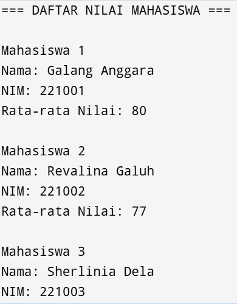

# NILAI-MAHASISWA
# Sistem Penilaian Mahasiswa Sederhana

## Deskripsi
Aplikasi konsol sederhana untuk menghitung nilai akhir mahasiswa dengan komponen:
- Nilai Tugas (30%)
- Nilai UTS (30%) 
- Nilai UAS (40%)

Dibangun menggunakan C# (.NET) dengan pendekatan berorientasi objek.

## Fitur
- 📝 Input data mahasiswa (Nama, NIM, Nilai)
- 🧮 Perhitungan otomatis nilai akhir
- 📊 Konversi nilai huruf (A-E)
- ✅ Validasi input sederhana
